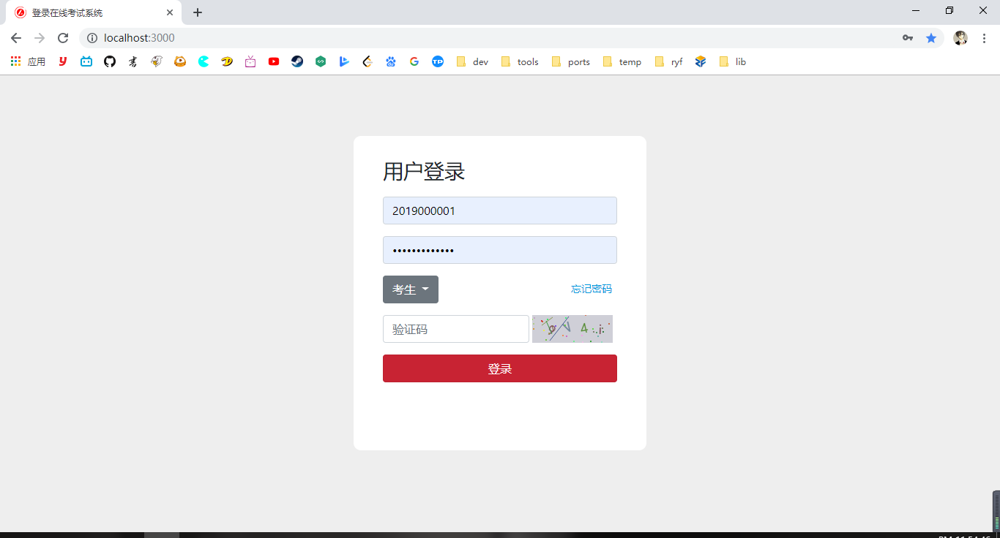
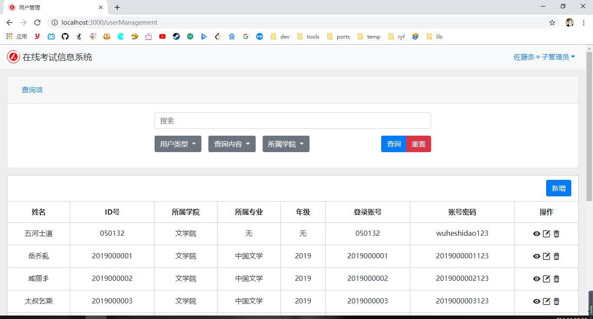
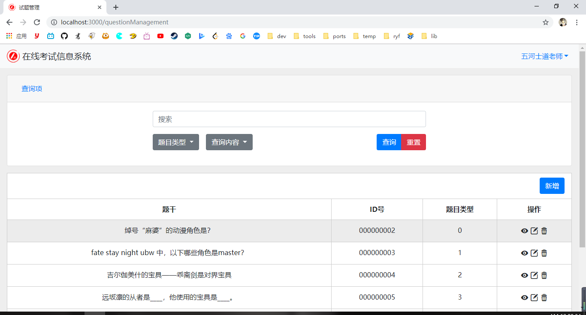
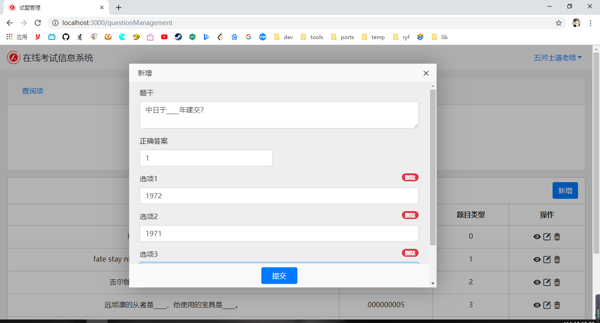
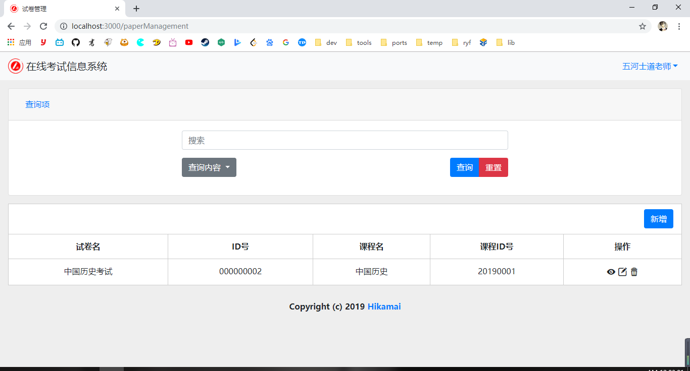
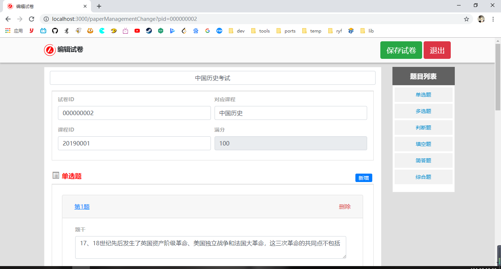
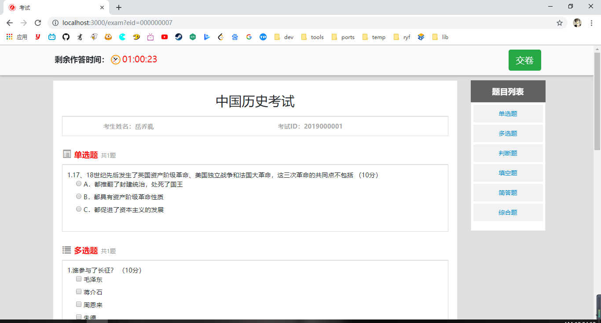
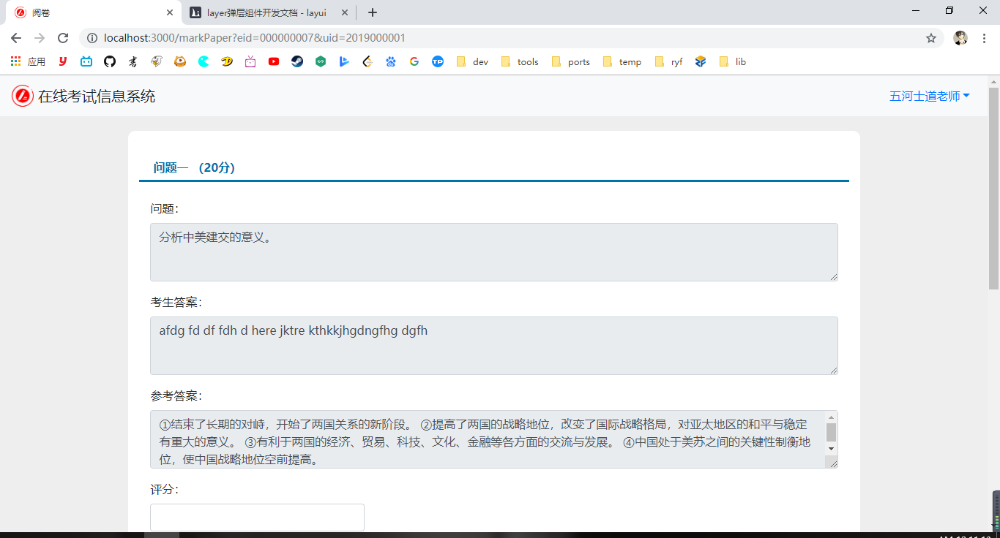
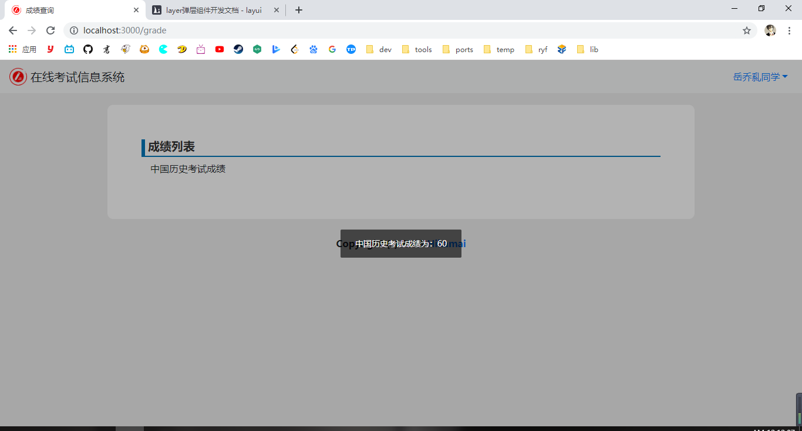

# 基于Node.js的在线考试系统
https://github.com/Gu-Miao/online_examination_system.git

# 开发背景

随着信息技术的日新月异，新兴技术逐渐走进人们的日常生活，改变着人们的工作和生活方式，传统纸质考试耗费大量人力物力资源，已经越来越不越能够满足教学的需要。开发一套在线考试的系统，使用数字化，信息化的方式对考试进行管理已经显得越来越必要。这不仅可以节省教学资源，减轻师生负担，更可以及时反馈考试信息，提高教学效率。

# 功能性需求

本系统的用户分为三类：学生，教师，系统管理员。
* 学生是系统的界面的主要使用者，在登录系统后可以选择科目进行考试或者查询自己的考试成绩。
* 教师是和考试题目，与试卷试题接触最紧密的角色，拥有试题管理，试卷管理，阅卷等。
* 管理员的主要职能则是对系统用户进行管理，包括添加用户，授权用户权限，管理用户信息等。

# 技术选型

* 前端： H5+CSS+JS，框架：Bootstrap, Jquery, layer, laydate, b4-table（自封装的表格组件库）
* 后端： Node.js，框架：express
* 数据库： MongoDB, 使用 Mongoose 连接数据库

# 功能实现

## 用户登录

用户登录页面  



## 用户管理

用户管理页面



## 试题管理

试题管理页面



新增试题页面



## 试卷管理

试卷管理页面



修改试卷管理页面



## 考试管理

考试管理页面


## 在线考试

在线考试页面



## 成绩管理

阅卷页面



成绩查询页面




# 项目总结

本设计基于 Node.js，使用 express 作为框架，MongoDB 作为数据库，结合前端技术，设计并实现了一款在线考试信息系统。完成了系统的用户登录、用户管理、试题管理、试卷管理、考试管理等功能模块，基本实现了系统的功能需求。

## 技术亮点

* 前端组件模块化和动态渲染

本系统的一部分页面需要根据后端返回的数据进行渲染，于是我需要动态渲染的 DOM 封装在 JS 函数中，然后在函数体内绑定事件函数或进行 DOM 操作，可以避免选择器滥用问题，之后在需要时进行调用组件函数，代码更加灵活。  

下面是新增试卷页面中渲染单选题使用的组件函数：

```js
// 单选题
function newSin($root) {

    let $dom = $(`
        <div class=" col-12">
            <div class="form-group col-12">
                <label>题干</label>
                <textarea class="content form-control"></textarea>
            </div>
            <div class="form-group col-6">
                <label>正确答案</label>
                <input type="number" class="answer form-control" min="1" step="1">
            </div>
            <div class="form-group col-12">
                <button class="addop btn btn-primary form-control w-100">添加选项</button>
            </div>
        </div>
    `);

    $dom.find('.addop').click(function () {
        let $dom1 = $(`
            <div class="form-group col-12">
                <label>选项${$dom.find('.op').length + 1}</label>
                <span class="badge badge-pill badge-danger float-right">删除</span>
                <input type="text" class="form-control op">
            </div>
        `);
        $dom1.find('.badge').click(function () {
            $dom1.remove();
            const op_count = $dom.find('.op').length;
            if ($dom.find('.answer').val() > op_count) $dom.find('.answer').val('');
            $dom.find('.answer').prop('max', op_count);
            for (let i = 0; i < op_count; ++i) {
                $dom.find('.op').eq(i).parent().find('label').html(`选项${i + 1}`);
            }
        });
        $dom.find('.addop').parent().before($dom1);
        const op_count = $dom.find('.op').length;
        if ($dom.find('.answer').val() > op_count) $dom.find('.answer').val('');
        $dom.find('.answer').prop('max', op_count);
    });
    $dom.find('.answer').blur(function () {
        const op_count = $dom.find('.op').length;
        console.log(op_count)
        if ($(this).val() > op_count) $(this).val('');
        $(this).prop('max', op_count);
    });

    $root.append($dom);
}
```

* 后端 Mongoose 数据模型和 express 路由的结构化

使用 Mongoose 需要定义 Schema 和 model，作者将每个 MongoDB 集合的数据模型定义好并使用 node.js 的 module.exports 暴露出来，再将它们集中放到一个文件夹中，之后在需要用到的时候再将其 require 到路由代码中。前端发起的每个求地址就是页面本身的 url，这样每一个路由只处理对应一个页面的 get, post, put, delete 等请求。这样就形成了一个页面对应一个路由，路由代码中需要操作数据库的哪个集合，就把对应的数据模型引入，很好的避免了数据模型重复定义，路由混乱等问题。

users 集合数据模型 users.js

```js
// 引入 Mongoose
let mongoose = require('./connect');

// 定义学生集合数据结构
let UsersSchema = mongoose.Schema({
    name: { // 中文姓名
        type: String,
        trim: true,
        minlength: 2,
        maxlength: 20
    },
    uid: { // 学工号
        type: String,
        trim: true,
        minlength: 1
    },
    grade: { // 年级
        type: String,
        trim: true,
        minlength: 1
    },
    college: { // 所属学院
        type: String,
        trim: true,
        minlength: 1
    },
    major: { // 所属专业
        type: String,
        trim: true,
        minlength: 1
    },
    username: { // 登录账号
        type: String,
        trim: true,
        minlength: 1
    },
    password: { // 登录密码，6~16 位数字字母，符号只可以使用 “_” 和 “.”。
        type: String,
        trim: true,
        minlength: 6,
        maxlength: 16,
        match: /^[\w_.]{6,16}$/
    },
    type: { // 用户类型
        type: Number,
        trim: true,
        minlength: 1,
        maxlength: 2,
    }
}, { versionKey: false });

module.exports = mongoose.model('Users', UsersSchema, 'users');
```

学生主页的路由 studentHome.js

```js
let express = require('express');
let router = express.Router();

/* GET users listing. */
router.get('/', function (req, res, next) {
    res.render('studentHome');
});

module.exports = router;
```

## 不足

* 缺少用户授权功能，此功能根据实际业务需求的不同需要根据实际情况添加。
* 前端样式单一，部分页面重复使用表格渲染造成样式单一，需要再优化。
* 缺少防作弊系统。